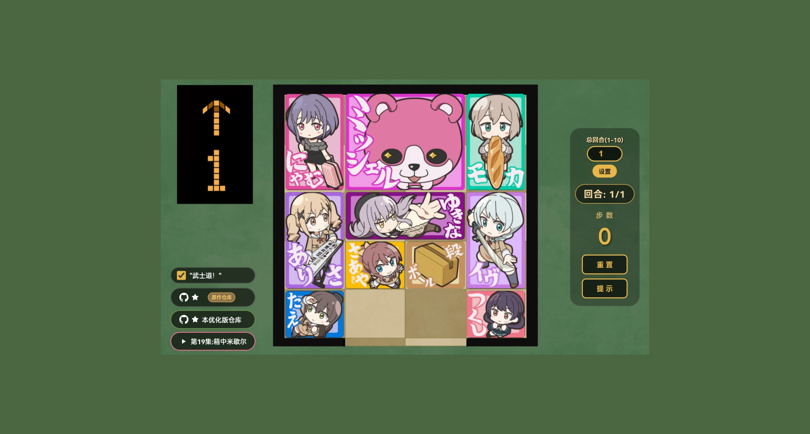

# 🎀 BanG Dream! 华容道小游戏 增强版

本项目Fork了[fflow2023的原仓库项目](https://github.com/fflow2023/BanGKlotski)，并在基础上优化了游戏体验，同时添加了部分音效

一个以 **BanG Dream!** 为主题的网页华容道（Klotski）益智小游戏。帮助米歇尔（Michelle）从重重包围中逃出，到达底部出口即为通关！

## 🎮 游戏特性

- **经典华容道玩法** — 4×5 棋盘，10 个角色方块，拖拽移动
- **智能提示** — 内置 BFS 最短路径求解器，点击"提示"自动执行最优下一步
- **纯前端单文件** — 零依赖，[**点击**](https://KasumiAmi.github.io/BanGKlotski_Enhanced) 即可游玩
- **移动端适配** 
- **可自定义最大回合数**
- **米歇尔胜利音效，截取自原动画**
- **伊芙酱“武士道”音效，可通过复选框进行开关控制**

## 💡 灵感来源

本项目灵感来源于动画 [《BanG Dream!》元祖第 19 集](https://www.bilibili.com/bangumi/play/ep3129294)，剧中出现了华容道的小游戏，于是萌生了复刻这个小游戏的想法。
maybe效果图可能与你实际访问看到的不一致，以实际访问的为准

## 🤖 关于开发

本Fork项目在原仓库的基础使用大模型进一步优化体验，使用了DeepSeek灰度更新的的新模型（2026年2月12号），官方未公布具体名称

## ⚖️ 版权声明

- 游戏中使用的角色图像、角色设定及相关素材版权归 **BUSHIROAD** 旗下 **BanG Dream! 企划** 所有。
- 本项目仅供娱乐及邦邦粉丝间的学习交流。